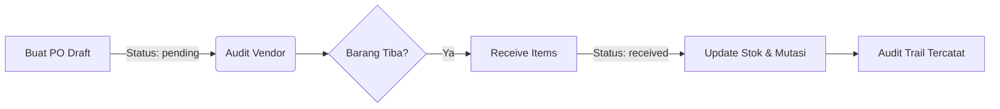

# 📘 Dokumentasi Pengembangan Fitur POS App

Dokumentasi ini mencakup fitur-fitur utama yang telah diimplementasikan: **Export Laporan**, **Purchase Order (PO)**, dan **Product Varian (Modifiers)**.

---

## 1. Export Laporan (CSV, XLSX, PDF)
Fitur ini memungkinkan Admin untuk mengunduh data laporan dalam berbagai format untuk keperluan audit dan arsip.

### 🔄 Alur Kerja (Flow):
1.  **Pemicu (Trigger)**: Admin memilih rentang waktu di halaman Laporan dan mengklik tombol "Export".
2.  **Pemetaan Data**: Frontend (`Reports/Index.vue`) mengambil data yang sedang ditampilkan (state `reportData`).
3.  **Proses Export (Client-Side)**:
    *   **CSV**: Menggunakan Blob URL untuk membuat file teks sederhana.
    *   **XLSX**: Menggunakan library `ExcelJS` untuk membuat spreadsheet dengan styling (bold header, currency format).
    *   **PDF**: Menggunakan `jsPDF` dan `jspdf-autotable` untuk merender tabel laporan ke dalam dokumen PDF.
4.  **Unduh**: File diunduh langsung ke perangkat user tanpa membebani server (Server-less generation).

---

## 2. Purchase Order (PO)
Fitur manajemen stok masuk yang terintegrasi dengan data Supplier untuk memastikan akurasi data inventori.

### 🔄 Alur Kerja (Flow):

1.  **Pembuatan PO**: Admin memilih Supplier, memilih produk yang ingin dipesan, dan menentukan jumlah serta harga beli. Status awal: `pending`.
2.  **Penyimpanan**: PO disimpan di tabel `purchase_orders` dan itemnya di `purchase_order_items`.
3.  **Penerimaan Barang**: Saat barang fisik tiba, Admin mengklik "Receive Items".
4.  **Update Sistem**:
    *   **Stok**: Menambah `current_stock` di tabel `store_inventories` secara otomatis.
    *   **Audit Trail**: Setiap kenaikan stok **wajib** mencatat `reference_id` yang mengarah ke ID Purchase Order. Hal ini memastikan setiap barang masuk dapat dilacak ke supplier mana dan PO nomor berapa saat audit stok opname dilakukan.
    *   **Status**: PO berubah menjadi `received` dan mencatat waktu penerimaan (`received_at`).

---

## 3. Product Varian (Modifiers)
Fitur untuk menangani variasi produk (Size, Toppings, Level Gula, dll) yang memiliki harga tambahan.

### 🔄 Alur Kerja (Flow):
1.  **Konfigurasi**:
    *   Admin membuat **Modifier Group** (misal: "Ukuran Gelas") pada form produk.
    *   Admin menambahkan **Modifier Options** (misal: "Small", "Large" +Rp 5.000).
2.  **Pemilihan di Kasir**: 
    *   Saat produk yang memiliki varian diklik, muncul **Modifier Selector Dialog**.
    *   User harus memilih sesuai aturan `min_select` dan `max_select`.
3.  **Perhitungan Harga**: 
    *   `Harga Item = (Base Price + Σ Price Extra Modifiers - Diskon Produk)`.
4.  **Penyimpanan Transaksi**:
    *   Pilihan varian disimpan di tabel `order_item_modifiers` agar struk belanja tetap menampilkan detail varian meskipun di masa depan konfigurasi produk berubah (Snapshot data).
5.  **Validasi & Stok**:
    *   **Client-Side**: Tombol konfirmasi di kasir akan *disabled* jika syarat `min_select` tidak terpenuhi.
    *   **Out of Stock Management**: Setiap opsi varian memiliki status `is_available`. Jika dinonaktifkan di admin, opsi tersebut akan muncul *greyed-out* (tidak bisa diklik) di kasir tanpa mengganggu penjualan produk utamanya.

---

## 4. Visualisasi Struk & Faktur
Untuk memudahkan pelanggan membaca detail varian, sistem menerapkan standarisasi tampilan:
- **Indentasi**: Daftar varian dicetak menjorok ke dalam (indented) di bawah nama produk utama.
- **Struk Thermal**: Menggunakan font mono dengan tanda `+` di depan setiap varian.
- **Faktur Formal (PDF)**: Menggunakan teks miring (*italic*) dengan perataan atas agar layout tetap rapi jika varian sangat banyak.

---

## 📊 Urutan Kalkulasi Akhir (Presedensi)
Sistem menggunakan logika **"Discount on Base"** untuk menjaga margin varian. Berikut urutan kalkulasinya:

1.  **Base Price** produk (Harga dasar katalog).
2.  **Extra Price** dari semua modifier yang dipilih (Ditambahkan ke total item).
3.  **Diskon Produk (Statis %)**: Dihitung **hanya dari Base Price** (dibulatkan). 
    *   *Catatan: Harga tambahan varian (Extra) tidak terkena potongan diskon produk agar integritas margin varian tetap terjaga.*
4.  **Subtotal Item** = `(Base + Extra - Diskon) * Quantity`.
5.  **Promo / Diskon Global** dipotong dari total akumulasi seluruh Subtotal (Semua item + varian).
6.  **Final Amount**: Nominal bersih yang harus dibayar pelanggan (Integer/Round).

---

## 5. Sistem Notifikasi Internal (Alerts)
Sistem memiliki modul notifikasi berbasis database (Laravel Notifications) untuk memantau aktivitas kritis secara real-time.

### A. Jenis Triger & Icon
| Triger | Ikon | Deskripsi |
|---|---|---|
| **Stok Menipis** | `Package` | Muncul saat stok produk turun ke/di bawah `min_stock` setelah transaksi kasir. |
| **Pesanan Baru** | `ShoppingCart` | Muncul saat setiap order baru dibuat di kasir (Takeaway/Dine-In). |
| **Target Tercapai** | `Target` | Muncul saat omzet harian toko mencapai/melampaui `Daily Sales Target`. |

### B. Mekanisme Real-Time
1.  **Frontend Polling**: Aplikasi Vue.js melakukan hit API ke `/admin/notifications` setiap 60 detik untuk mendeteksi pesan baru tanpa refresh.
2.  **Notification Drawer**: Panel notifikasi dapat dibuka lewat ikon Lonceng di Header.
3.  **Mark as Read**: Notifikasi yang sudah dibaca/dikonfirmasi akan hilang dari daftar unread (tersimpan di database).

### C. Pengaturan Target Penjualan
Penyetelan target dilakukan per cabang (Store) di menu **Edit Toko**. Target ini bersifat harian dan akan mereset status penembusannya setiap hari baru.

---

## 6. Feedback Pelanggan (Post-Transaction)
Fitur ini memungkinkan kasir untuk menangkap sentimen pelanggan tepat setelah transaksi selesai.

### A. Alur Kerja Modal Feedback
1.  **Trigger Otomatis**: Setelah pembayaran berhasil, aplikasi akan menampilkan popup "Terima Kasih" yang meminta masukan.
2.  **Star Rating**: Pelanggan memberikan rating 1 hingga 5 bintang.
3.  **Komentar Opsional**: Terdapat kolom teks untuk mencatat kritik/saran manual.
4.  **Tindakan Pelanggan**:
    *   **Kirim Feedback**: Mengunci ulasan ke database untuk keperluan laporan analitik.
    *   **Mungkin Nanti**: Menutup dialog tanpa menyimpan data (feedback bersifat opsional).

### B. Penyimpanan Data
Data feedback disimpan di tabel `order_feedbacks` dan terhubung secara relasi *one-to-one* dengan tabel `orders`. Sistem juga mencatat `source` (asal transaksi) untuk membedakan feedback dari Kasir atau pesanan QR di masa depan.

---

## 7. Optimasi Performa & Keamanan
Aplikasi telah dioptimasi untuk menangani kunjungan tinggi dan menjaga integritas data.

### A. API Caching (Response Accelerations)
Untuk mempercepat waktu muat (loading time) kasir, sistem menerapkan **Caching Layer** (TTL 1 jam):
- **Store Products**: Daftar produk per toko disimpan di cache `store_products_{id}`.
- **Categories**: Daftar kategori brand disimpan di cache `brand_categories_{id}`.
- **Benefit**: Mengurangi SQL query hingga 80% saat kasir membuka katalog produk.

### B. Middleware Security
Seluruh rute admin dan kasir dilindungi oleh:
- `auth:sanctum`: Menjamin hanya user terdaftar yang bisa mengakses data.
- `EnsureAuthenticated`: Middleware custom untuk membatasi akses berdasarkan **Role** (Owner, Admin, atau Cashier) sesuai dengan cakupan fiturnya.

---

## 8. Persiapan Deployment (Checklist)

*   **Database**: Jalankan `php artisan migrate` untuk mengaktifkan tabel feedback, notifikasi, dan kolom target penjualan.
*   **Optimization**: Jalankan `php artisan config:cache` dan `php artisan route:cache` di production.
*   **Backup**: Sangat disarankan menginstal package `spatie/laravel-backup` dan menjadwalkan backup database harian (00:00) ke cloud storage (Google Drive/S3).
*   **Environment**: Pastikan `CACHE_DRIVER` dikonfigurasi (default: `file`, disarankan: `redis` jika tersedia di server Hostinger) untuk kestabilan polling notifikasi.

